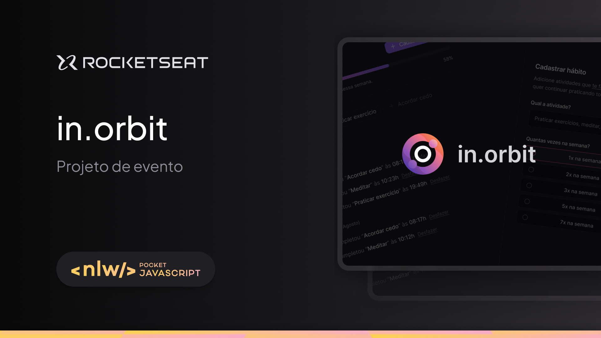
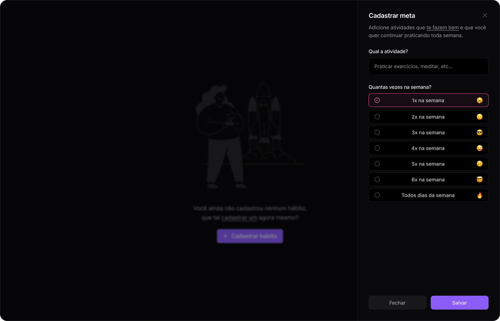
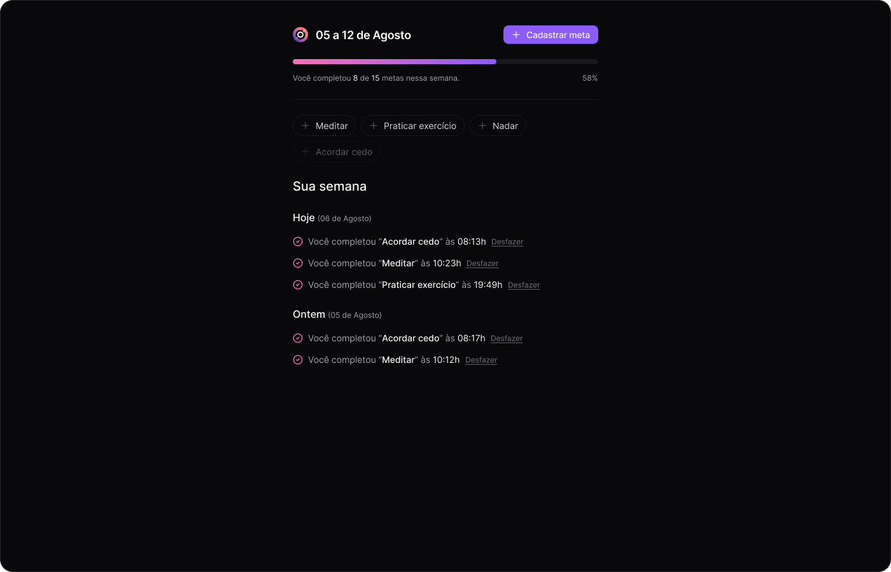

# 📋 **Projeto de Registro de Metas - NLW Pocket Javascript 2024**



Este projeto foi desenvolvido durante o evento **NLW Pocket Javascript** promovido pela **Rocketseat** entre os dias **09/09/2024** e **12/09/2024**, com o conteúdo apresentado por **Diego Fernandes**. O projeto consiste em um **site desktop de registro de metas**, focado no acompanhamento do progresso semanal.

## 🚀 **Sobre o Projeto**

O objetivo principal deste projeto é criar uma aplicação completa de **registro de metas**, onde o usuário pode adicionar metas, verificar o progresso semanal e acompanhar seu desempenho. O projeto foi desenvolvido utilizando tecnologias modernas tanto no back-end quanto no front-end, aplicando conceitos fundamentais de desenvolvimento de software.

## 🔥 **Tecnologias Utilizadas**

### Backend:
- **Node.js**: Ambiente de execução do código Javascript no servidor.
- **Fastify**: Framework web para Node.js, rápido e eficiente.
- **TypeScript**: Tipagem estática para melhorar a manutenção e escalabilidade do projeto.
- **DrizzleORM**: Integração com banco de dados PostgreSQL para manipulação de dados.
- **PostgreSQL**: Banco de dados relacional utilizado no projeto.
- **Docker**: Containerização para garantir um ambiente de desenvolvimento uniforme.
- **Zod**: Biblioteca de validação de dados para garantir que os dados recebidos pela API sejam válidos.

### Frontend:
- **ReactJS**: Biblioteca JavaScript para construção de interfaces de usuário.
- **Vite**: Ferramenta de build rápida e otimizada para desenvolvimento de front-end.
- **TypeScript**: Tipagem estática no desenvolvimento do front-end.
- **TailwindCSS**: Framework de estilização baseado em utilitários para criar interfaces responsivas.
- **TanStack Query**: Ferramenta para gerenciamento de dados assíncronos e otimização de chamadas API no front-end.

## 🖼 **Layout**


### Exemplo de Tela - Adicionar Meta



*O design foi projetado para uma interface moderna e minimalista, focada na usabilidade e experiência do usuário.*

### Exemplo de Tela - Metas Cadastradas



## ⚙️ **Funcionalidades Implementadas**

- **Registro de Metas**: O usuário pode adicionar metas com uma frequência semanal desejada.
- **Progresso Semanal**: Visualização do progresso de metas com base na quantidade de metas completadas dentro da semana.
- **Validação de Dados**: Uso do Zod no back-end para garantir que os dados enviados e recebidos pela API estejam corretos.
- **Persistência no Banco de Dados**: Utilização do DrizzleORM com PostgreSQL para armazenar metas e seu progresso.
- **Consumo de API REST**: O front-end utiliza o TanStack Query para gerenciar chamadas à API do back-end, garantindo dados atualizados de forma eficiente.

## 🛠️ **Como Rodar o Projeto**

### Pré-requisitos:

- **Node.js** versão 18 ou superior
- **Docker** e **Docker Compose**
- **PostgreSQL** rodando no Docker

### Passos:

1. Clone o repositório:
    ```bash
    git clone https://github.com/CarolPatricio/pocket-javascript.git 
    ```

2. Instale as dependências do backend:
    ```bash
    cd server
    npm install
    ```

3. Configure o banco de dados no Docker:
    ```bash
    docker-compose up -d
    ```

4. Rode as migrações para o banco de dados:
    ```bash
    npm run migrate
    ```

5. Inicie o servidor backend:
    ```bash
    npm run dev
    ```

6. Para o frontend, vá até o diretório:
    ```bash
    cd web
    npm install
    ```

7. Inicie o servidor frontend:
    ```bash
    npm run dev
    ```

8. Acesse o projeto no navegador:
    ```
    http://localhost:5173
    ```


## 🎓 **Conteúdos Aprendidos no Evento**

Durante o evento, aprendemos e aplicamos os seguintes conceitos:

- **Criação de APIs RESTful** com Node.js e Fastify.
- **Validação de dados** no back-end com Zod.
- **Integração com banco de dados** PostgreSQL usando DrizzleORM.
- **Containerização de serviços** com Docker.
- **Desenvolvimento de front-end reativo** com ReactJS e gerenciamento de estado.
- **Tipagem forte com TypeScript** tanto no front quanto no back.
- **Consumo de API** no front-end com TanStack Query para dados assíncronos.
- **Estilização responsiva** com TailwindCSS.


---

## 📚 **Licença**

Este projeto foi idealizado pela [Rocketseat](https://www.rocketseat.com.br/?utm_source=google&utm_medium=cpc&utm_campaign=lead&utm_term=perpetuo&utm_content=institucional-lead-home-texto-lead-brandkws-none-none-institucional-none-none-br-google&utm_term=rocketset&utm_campaign=PROGRAMAS-ALL-BRANDKWS-SEM&utm_source=adwords&utm_medium=cpc&hsa_acc=8545075154&hsa_cam=16048648686&hsa_grp=135825188594&hsa_ad=579096962131&hsa_src=g&hsa_tgt=kwd-831626289807&hsa_kw=rocketset&hsa_mt=b&hsa_net=adwords&hsa_ver=3&gad_source=1&gclid=CjwKCAjw0aS3BhA3EiwAKaD2ZXexU58IOwID2bKf8twfST6-J1b-9k8oB6N3Q2Hk5h4zYnkLRgEtexoCL60QAvD_BwE).

---

**Desenvolvido durante o evento NLW Pocket Javascript com ❤️ pela Rocketseat**.
